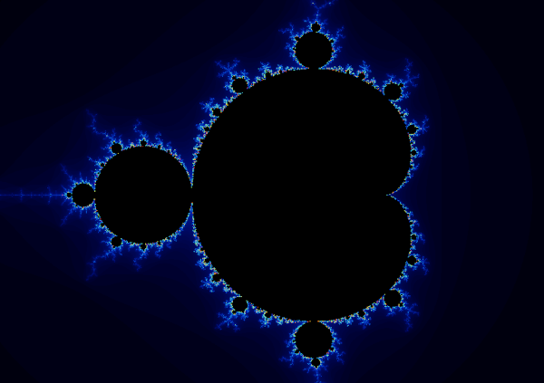
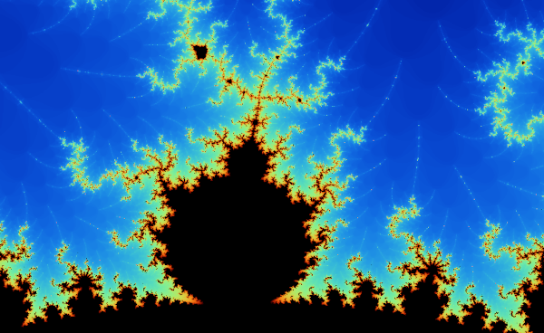
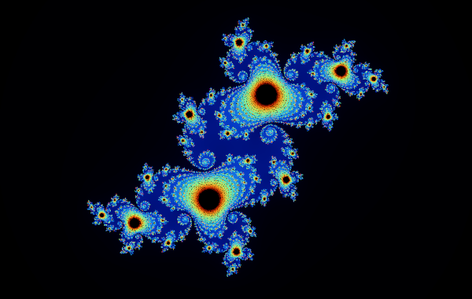
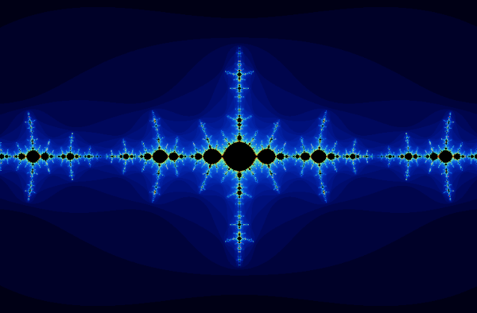

# Fractals


An application written in Go to generate fractals like the [Mandelbrot set](https://en.wikipedia.org/wiki/Mandelbrot_set) and the [Julia set](https://en.wikipedia.org/wiki/Julia_set).

## Screenshots

### Mandelbrot set



### Julia set



## Prerequisites

- [Go 1.17+](https://go.dev/)
- C compiler
  - Windows: [Mingw-w64](https://mingw-w64.org/) or [TDM-GCC](http://tdm-gcc.tdragon.net/)
  - macOS: Xcode or Command Line Tools for Xcode
  - Linux: [gcc](https://gcc.gnu.org/) or [clang](https://clang.llvm.org/)

## Building/Running

```sh
git clone https://github.com/Bananenpro/fractals.git
cd fractals
go run ./cmd
```

## License

This program is free software: you can redistribute it and/or modify
it under the terms of the GNU General Public License as published by
the Free Software Foundation, either version 3 of the License, or
(at your option) any later version.

This program is distributed in the hope that it will be useful,
but WITHOUT ANY WARRANTY; without even the implied warranty of
MERCHANTABILITY or FITNESS FOR A PARTICULAR PURPOSE.  See the
GNU General Public License for more details.

You should have received a copy of the GNU General Public License
along with this program.  If not, see <http://www.gnu.org/licenses/>.

## Copyright

Copyright © 2022 Julian Hofmann
